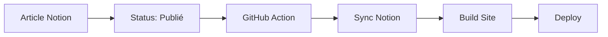

# 🚀 Configuration Automatisation Notion → Site Web

## 📋 Étapes de configuration

### 1. Créer une intégration Notion

1. Aller sur https://www.notion.so/my-integrations
2. Cliquer **"New integration"**
3. Nommer l'intégration: `Logiciel France Blog`
4. Sélectionner le workspace
5. Copier le **Internal Integration Token** (commence par `secret_`)

### 2. Préparer la base de données Notion

Votre base doit avoir ces colonnes exactes :

| Nom de la colonne | Type | Obligatoire |
|-------------------|------|-------------|
| **Titre** | Title | ✅ |
| **Slug** | Text | ✅ |
| **Status** | Select (Brouillon, En révision, Publié) | ✅ |
| **Date de publication** | Date | ✅ |
| **Extrait** | Text | ✅ |
| **Auteur** | Person | ⚪ |
| **Catégorie** | Select | ⚪ |
| **Tags** | Multi-select | ⚪ |
| **Image de couverture** | Files & media | ⚪ |

### 3. Partager la base avec l'intégration

1. Ouvrir votre base de données Notion
2. Cliquer sur **"..."** (trois points) en haut à droite
3. Sélectionner **"Add connections"**
4. Choisir votre intégration `Logiciel France Blog`

### 4. Récupérer l'ID de la base

L'ID se trouve dans l'URL de votre base Notion :
```
https://www.notion.so/workspace/XXXXXXXXXXXXXXXXXXXXXXXXXXXXXXXX?v=...
                                ↑ Copier cette partie (32 caractères)
```

### 5. Configurer les secrets GitHub

Dans votre repository GitHub :
1. Aller dans **Settings** → **Secrets and variables** → **Actions**
2. Ajouter ces secrets :

```
NOTION_TOKEN = secret_XXXXXXXXXXXXXXXXXXXXXXXXXXXXXXXXXXXXXXXXXXXXXXXX
NOTION_DATABASE_ID = XXXXXXXXXXXXXXXXXXXXXXXXXXXXXXXX
```

### 6. Tester la configuration

```bash
# Installer les dépendances
npm install

# Configurer les variables localement pour tester
export NOTION_TOKEN="secret_votre_token"
export NOTION_DATABASE_ID="votre_database_id"

# Tester la connexion
npm run test-notion

# Si le test passe, synchroniser le contenu
npm run sync-notion
```

## 🎯 Comment utiliser

### Publication automatique

1. **Créer un article dans Notion**
2. **Définir le Status sur "Publié"**
3. **Le site se met à jour automatiquement** (via GitHub Actions)

### Publication manuelle

```bash
# Synchroniser depuis Notion
npm run sync-notion

# Builder le site
npm run build
```

### Déclenchement via webhook

Pour une publication instantanée, créer un webhook qui appelle :
```bash
curl -X POST \
  -H "Authorization: token GITHUB_TOKEN" \
  -H "Content-Type: application/json" \
  -d '{"event_type": "notion-publish"}' \
  https://api.github.com/repos/OWNER/REPO/dispatches
```

## 🔧 Structure des fichiers

```
scripts/
├── sync-notion.js       # Script principal de synchronisation
├── test-notion.js       # Test de connexion Notion
└── trigger-notion-sync.js # Déclencheur webhook

.github/workflows/
├── deploy.yml           # Build et déploiement
└── notion-sync.yml      # Synchronisation Notion

public/posts/            # Articles générés (JSON)
```

## ❗ Dépannage

### Erreur "unauthorized"
- Vérifier le token Notion
- S'assurer que l'intégration a accès à la base

### Erreur "object_not_found"  
- Vérifier l'ID de la base de données
- S'assurer que la base existe et est partagée

### Articles non synchronisés
- Vérifier que le Status est "Publié"
- Contrôler les propriétés requises dans Notion

## 🚀 Flux complet

